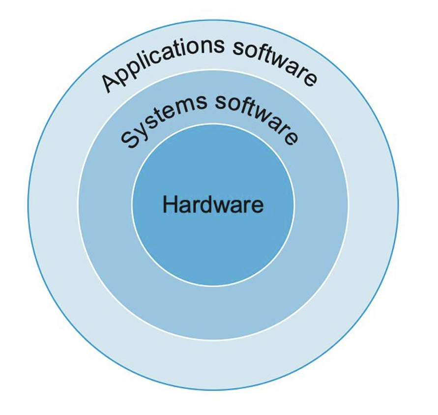

<!-- p3 -->

# 소프트웨어 계층

  <!-- Text on the Left -->
  

## Application Software

- 유저가 직접 상호작용하는 프로그램 (e.g., browsers, games, editors)
- 하드웨어와 직접 상호작용을 할 수 없음

## System Software

- 유저 애플리케이션과 하드웨어를 연결하는 역할

### 1. **Operating System (OS)**

- 메모리와 저장장치 할당
- 입출력 동작 처리
- 애플리케이션의 병렬 처리

### 2. **Compiler**

- High-level (C, Python 등) 코드 → 하드웨어가 실행 가능한 명령어 (binary 등)로 변환

## Hardware (Bottom Layer)

- 물리적으로 존재하는 장치 (CPU, RAM, disk 등)
- 기계어(machine code)만 이해함

  

  <!-- Image on the Right -->
  

    
  

<!-- p4 -->

# From High-Level Language to Machine Code

  <!-- Left: Visual Transformation Flow -->
  

    
High-level language (C code)

    Text composed of words and algebraic notation

    
 ↓ 

    
Compiler

    High-level language ➝ Assembly language

    
 ↓ 

    
Assembly language (ARM code)

    A symbolic representation of machine instructions

    
 ↓ 

    
Assembler

    Assembly language ➝ Machine language

    
 ↓ 

    
Machine language

    A binary representation of machine instructions

  

  <!-- Right: Explanatory Notes in Korean -->
  

  
코드 변환할 때 여러 용어가 사용

- Compiling, Assembling, Linking, Building
- 일부 컴파일러는 중간 과정을 생략하고 직접 바이너리로

   

  
고-수준 언어를 강조하는 이유

**이점:**

- 영어, 대수 표기법 이용 → 프로그래머에게 쉬움
- 텍스트처럼 보이는 프로그램 작성 가능
- 프로그래머 생산성 향상, 개발 시간 절약
- 개발하는 컴퓨터와 무관하게 개발 가능

   
  <strong style="color: #555;">➡️ 대상 머신에 최적화된 효율적인 어셈블리 코드를 만드는 컴파일러 개발이 중요함</strong>

  

