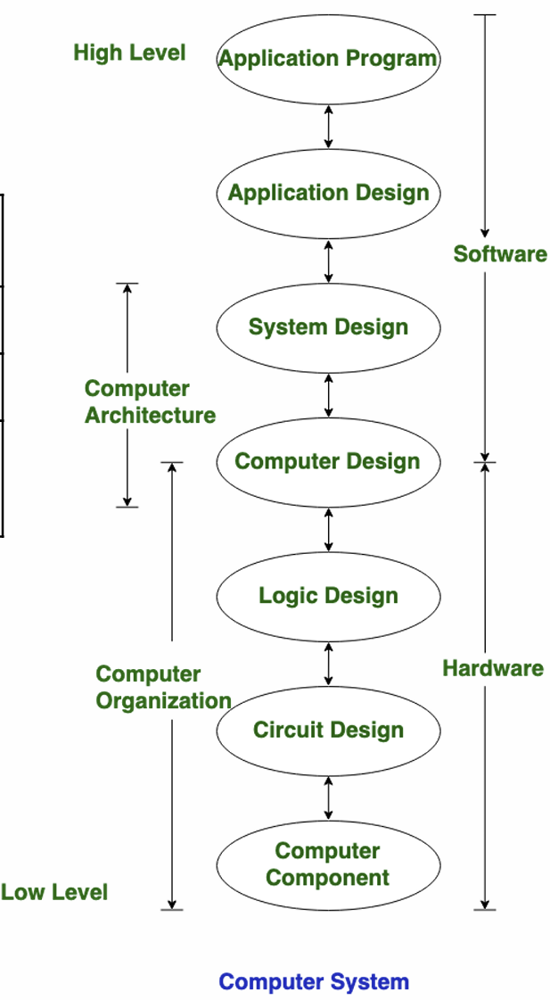

<!-- p3 -->

# Intro

마이크로프로세서는 많은 과학적 혁신을 뒷받침하고 통신, 연산, 스토리지가 거의 무료에 가까운 디지털 세상을 만드는데 기여를 함

- 현대 컴퓨터 역사는 100녀이 안됨
  - 1930, 1940에 최초의 전자기계 및 밸브 기반 기계를 생산 -> 현대 컴퓨터는 더 빠르고, 전력 소모가 적고, 안정적

<!-- p5 -->

# 추상화 수준(Levels of Abstraction)

## Architecture

프로세서의 전반적인 구조와 기능을 정의

- 개발자가 소프트웨어 및 펌웨어를 작성할 수 있도록 하는 일련의 사양
- 명령어 세트(Instruction Set), Data type, processor mode, addressing mode 등이 포함

## Micro-architecture

컴퓨터 내부 구조의 논리적 구성(회로 디자인)

- 특정 아키텍처를 실제로 구현하는 세부적인 구조와 설계를 의미
  - 파이프라인 디자인, 캐시 메모리 구조, 분기 예측 등 최적화 기술

 
전체적인 디자인과 성능 vs 성능이 프로세서 내부에서의 실제 동작 기획

## Hardware or Implementation

물리적 구현

<!-- p6 -->

# Computer Architecture vs. Organization

<!-- Text (Left) -->

두 개는 관련이 있지만 컴퓨터 사이언스 분야에서는 **구분되는 개념**

| **Computer Architecture**                                                     | **Computer Organization**                                        |
| ----------------------------------------------------------------------------- | ---------------------------------------------------------------- |
| 컴퓨터가 수행하는 작업                                                        | 컴퓨터가 수행하는 방법                                           |
| 프로그래머가 볼 수 있는 시스템 구조와 기능                                    | 시스템 구현을 위한 하드웨어 구성                                 |
| 명령어 세트, 레지스터, 데이터 유형, 메모리, 주소 지정 모드와 같은 논리적 기능 | 회로 설계, 논리 회로, 제어 장치, 연산 장치 등과 같은 물리적 단위 |

- **Computer Architecture**는 하드웨어가 구현해야 할 것을 먼저 정의

<strong>Computer Architecture ➡ Computer Organization</strong>

<!-- Image (Right) -->

  

<!-- p7 -->

## 아키텍처 사양 (Archtecture Specification)

- 아키텍처는 하드웨어와 소프트웨어가 서로 문제없이 작동할 수 있도록, 명확하게 정해 놓은 둘 사이의 연결 방식과 규칙
  - 전력 소비, 비용, 면적, 성능 목표 등을 충족하기 위해 다양한 호환 프로세서 가능
- 소프트웨어가 아키텍처 사양을 잘 따르면, 다른 하드웨어에서도 문제없이 실행

 
 

 
 

# Computer Architecture

단순한 명령어 정의를 넘어서, HW/SW가 효과적으로 연결되도록 전체 구조를 설계하는 것

- 몇 가지 기본 개념 위에 구축 -> 새로운 해법을 끊임없이 찾아야 함
- 전력, 자원 등 제한된 조건 속에서 전력, 비용, 면적, 성능 등 종합해서 높은 효율, _최선_ 을 추구 (최선은 상황과 목적에 따라 달라짐)
  - 과거 기술과 워크로드에만 의존하지 않고 미래의 변화도 함께 고려
  - 설계는 실험과 검증을 통해 신중하게 결정

   

## What shapes computer architecture?

  

## Design Goal

- **Function(기능)**  
  시스템이 수행해야 하는 역할과 동작

  - 수정이 어려움
  - 검증은 설계 과정에서 가장 많은 비용이 듬 (칩 제조 후에 많은 비용이 들기 때문에 설계 단계에서 신중한 고려가 필요)

- **Performance(성능)**  
  시스템이 얼마나 빠르고 효율적으로 작업을 수행하는지

  - 작업 목적(작업 부하)에 따라 요구 성능이 다름 -> 절대적 최선이 없음

- **Power(전력)**  
  시스템이 사용하는 에너지의 양

  - 제일 먼저 고려되는 제약 조건 중 하나 - 시스템 성능을 제한/결정을 함

- **Security(보안)**
  민감한 데이터와 시스템 제어권을 보호하는 기능 - 악의적 입력이나 외부 접근으로부터 프로세서를 **안전하게 보호**

- **Cost(비용)**
  시스템을 설계·생산하는 데 드는 자원 - 설계 복잡도, 다이 크기, 패키징 등

- **Reliability(신뢰성)**
  시스템이 얼마나 오류 없이 안정적으로 동작하는가 - 작동 중 오류를 감지/허용하는가?

## Markets and Features

각 목표 시장마다 전력 소비, 비용, 면적, 성능, 보안, 신뢰성 등의 측면에서 서로 다른 절충안이 필요
 

> **Arm의 몇가지 프로세서 클래스 예시**
>
> - Cortex-A: 고성능 애플리케이션 프로세서
>   - 예: 휴대폰용
> - Cortex-R: 결정론적 실시간 성능 (deterministic real-time performance)
>   - 오류 감지 (fault detection), 내성 (tolerance) 기능 포함
> - Cortex-M: 에너지 효율적인 임베디드 디바이스
>   - '마이크로컨트롤러' 클래스 코어
> - Neoverse: 단일 칩의 확장 가능한 프로세서 네트워크
>   - 예: 8, 16, 64 또는 128코어
>   - 데이터센터, 엣지 서버, 스토리지 등에 사용
